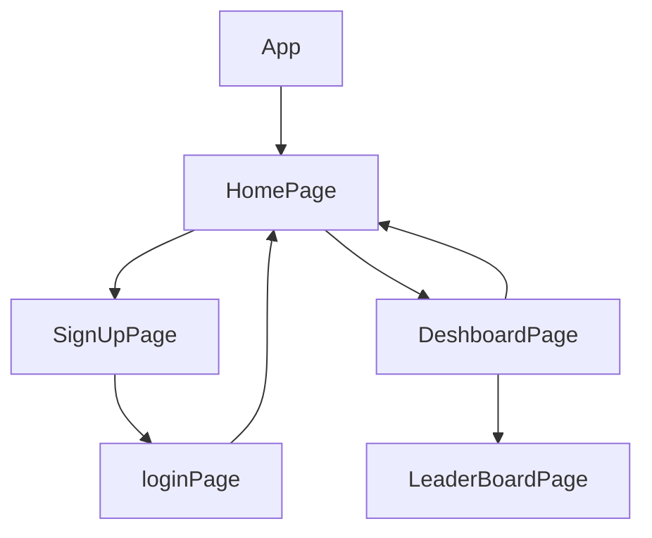

> 💻 PROJECT NAME -------------> CHANDA KAUDI🎮

 

---

> ✨ABOUT GAME AND THEIR RULES

⭕CHANDA KAUDI ,also known as Chaupar or Chaubara, is a traditional Indian board game that has been enjoyed enjoyed in India for centuries, and it is still played by many people today.

⭕The game is similar to Pachisi and Ludo, and it is usually played on a wooden board with 5x5 or 7x7 grids.The board has a central square known as the "Chaubara," which means "four houses."

⭕The game is played with a board that has four colored squares, each with a set of four houses, and a central cross-shaped square that serves as a starting and finishing point for each player's pieces. 

⭕The game is usually played by two to four players, each of whom has four pieces or pawns that they move around the board according to the roll of a dice.

⭕The objective of the game is to move all four of your pieces from the starting point to the finishing point, using a set of dice to determine how many spaces you can move on each turn. The first player to move all of their pieces to the finishing point wins the game.

⭕One of the unique features of Chanda Kaudi is its ability to be played by people of all ages, making it a great game for families and friends to enjoy together. 
The game can be played with a computer opponent, multiplayer game with people from around the world. 

⭕Additionally, players can connect with each other by real time chats while playing the game together..This was a collaborative Project which is made by 4 team members within 2 Days.

---

## 🔗 Collaborators Profile Links✨

| Collaborators | Github                                                                                                                                   | Linkedin                                                                                                                                                            | Portfolio                                                                                                                                    |
| ------------- | ---------------------------------------------------------------------------------------------------------------------------------------- | ------------------------------------------------------------------------------------------------------------------------------------------------------------------- | -------------------------------------------------------------------------------------------------------------------------------------------- |
| Shikha Gupta  (Member 1)| |  | | 
|abhay faldu (Member 2) |  |  |  |
| Nikhil Deora (Member 3) |  | |  |
| Rishav Chakraborty (Member 4)|  | |  |

 

💻 Projectlogo :- 

 

---
## 💫Tech-Stack->

- #### For Frontend :-
   - `HTML5`
  - `CSS3`
  - `JavaScript `
   - `Redux`
  - `ReactJS`
  - `Typescript `
   - `ES6 `

- #### For Backend :-
   - `NodeJS`
   - `ExpressJS`
   - `MongoDB `

- #### For deploy database :- 
   - `cyclic `

- #### For Styling :-  
   - `Chakra UI `
   

- #### For live Project : -
   - `Vercel`
   

---
## Features ✨:-
---
 | Serial No            | Feature                                                              |
| ----------------- | ------------------------------------------------------------------ |
| 1 | User signup and Login |
| 2 | Home Page  |
| 3 | Dashboard Page  |
| 4 | LeaderBoard  Page|
| 5 | navbar , footer |
| 6 | demo video , about game and rules  |

---
# Package.json(Dependency)✨:-

 | Serial No            | Backend                      |  Frontend      |
| ----------------- | -------------------|------------------------ |
| 1 | bcrypt |   Chakra-ui |
| 2 | mongoose |  React Router dom |
| 3 | cors |    redux ,react-icons |
| 4 | dotenv |  react redux ,axios |
| 5 | express | typescript |
| 6 | jsonwebtoken | redux thunk |

---

## Flow

---
## Screenshots 📷
---

# HomePage

# Signup Page 

# LoginPage

# DeshboardPage

# LeaderBoardPage

---

<h1 align="center">✨Thank You✨</h1>
